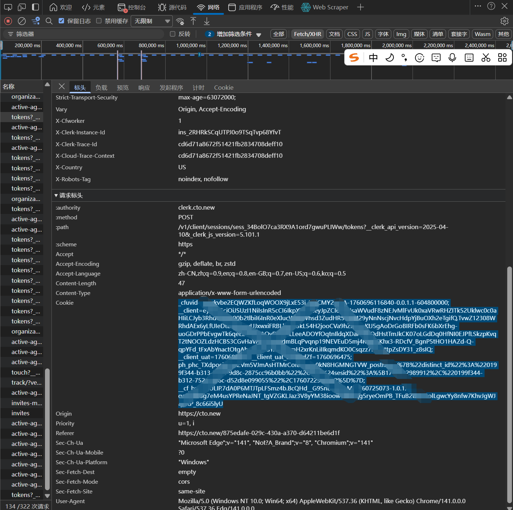

# CTONEW
玩具，支持多轮对话、输出思维链，Oai ChatCompetition 格式

### Deno Deploy部署

设置入口文件为 `main.ts`
### 环境变量

在 Deno Deploy 项目设置中添加环境变量：

- `ADMIN_KEY`: 管理后台密钥（**必填**，请使用强密码）

- `PORT`: 服务端口（默认 8000）

### 管理后台

1. 访问 `http://localhost:8000/admin/login` 登录
2. 输入管理密钥（默认: `your-secret-key-change-me`）
3. 密钥会保存在浏览器，下次自动登录

## 获取 Cookie

1. 访问 https://cto.new
2. 登录你的账号
3. 打开浏览器开发者工具（F12）
4. 找到 "Cookies" → "https://clerk.cto.new"
5. 复制 Cookie 值（格式：`name1=value1; name2=value2`）
如图

7. 在管理后台添加 Cookie

## License

MIT
